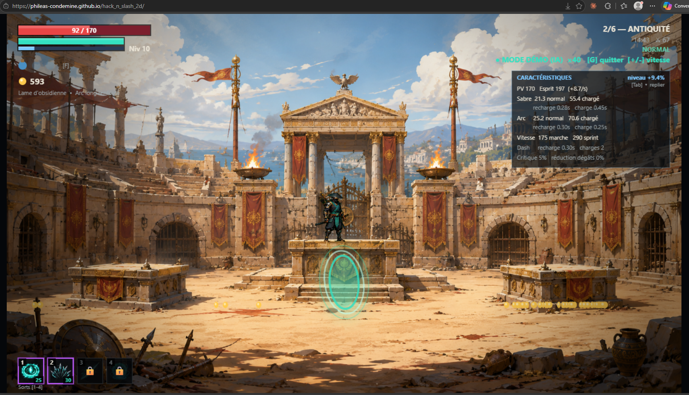

# TODO — Pistes d'amélioration

Backlog vivant des idées de gameplay/équilibrage à ne pas oublier. À mettre à jour au fil de l'eau
(cocher, préciser, ou ajouter des idées). Peut servir de base de travail pour plusieurs agents en parallèle,
chacun prenant une section indépendante.

## 🪙 Économie (or / points de compétence) — PRIORITAIRE

Constat : à R3/6, déjà 2000 or (cap ?), quasiment tous les objets achetables, la plupart des sorts
puissants (arc + magie) débloqués, et les autres compétences bien montées aussi. Le jeu devient trop
facile trop vite car l'arbre de compétences et l'amélioration d'armes sont "finis" avant la fin de la run.

- [x] **Auditer les gains théoriques max sur une run complète (R1→fin)** — fait le 2026-07-26, par lecture de code (`src/data.js`, `src/player.js`, `src/game.js`) **+ playthrough automatisé réel** (mode démo IA, invincibilité temporaire, vitesse ×40, via console navigateur) pour obtenir des chiffres empiriques plutôt que des estimations :
  - **Pas de cap d'or dans le code** (vérifié : aucun `Math.min`/clamp sur `game.coins`). Le "plafond ~2000" que tu observais est un *équilibre offre/demande* : une fois les crans d'armes et l'arbre bien avancés, il n'y a simplement plus assez d'objets en boutique pour absorber l'or gagné — ce n'est pas une limite technique, c'est un manque de puits d'or (gold sinks).
  - **Points de compétence — l'arbre entier ne coûte que 40 points** : 4 branches (lame/arc/corps/esprit) × coût cumulé `1+2+3+4=10` chacune. Sources : +1 automatique par montée de niveau (`player.js:528`, courbe `xpNext = round(60 × 1.32^(niveau-1))`, donc ~60/80/106/140/... XP par niveau) ; +1 avec ~20-25% de chance par coffre ouvert (normal *ou* perché) ; +2 en un coup via le choix de faille "Méditation" (1 des 8 récompenses de faille possibles, proposée aléatoirement 1 fois sur 3 à chaque changement d'ère) ; +1 achetable en boutique via "Parchemin ancien" (150 or × inflation d'ère) — **l'or peut donc directement s'échanger contre des points de compétence**, ce qui aggrave le problème au lieu d'offrir un vrai choix.
  - **Crans d'arme — 5 paliers chacun pour l'épée et l'arc**, obtenables gratuitement en coffre (~20-25% de chance) ou pour 130 or (× inflation) en boutique, sans aucune autre condition.
  - **Mesuré en jeu (run automatisée, IA + god mode, seed aléatoire)** : dès l'entrée en R5 (ère 5/6), une run avait déjà atteint niveau 15, **épée ET arc au palier max (5/5)**, 12 des 16 nœuds de compétence débloqués (75% de l'arbre), 3 884 or en poche, 5 123 or gagnés au total. Une autre run, à l'entrée en R6 (dernière ère), affichait niveau 16, 11/16 nœuds, 5 581 or en poche, 7 894 or gagnés au total. **Autrement dit : tout ce qui compte pour la puissance du build (armes + magie) est bouclé avant même la dernière ère**, exactement le ressenti que tu décrivais à R3/6.
  - **Le vrai goulot n'est pas le manque d'or gagné, c'est le manque de débouchés** : la boutique ne propose que 9 objets distincts, se restocke à chaque ère avec 4 emplacements (1 potion + 3 tirés au hasard parmi les 8 autres), prix inflatés de +18%/ère. Les items "cran d'arme"/"parchemin" sont à usage unique par visite (`sold`) ; seuls crit/PV/esprit/vitesse sont ré-achetables mais sans plafond ni coût croissant intra-item — donc au-delà d'un certain point, l'or excédentaire ne fait qu'attendre le prochain restock aléatoire, il n'est jamais vraiment "dépensable à volonté".
  - ⚠️ Effet de bord découvert pendant l'audit (sans lien avec l'économie) : le bug d'IA "héros bloqué sur la plateforme au-dessus du portail en fin d'ère 2" (déjà noté dans la section IA du héros ci-dessous) s'est reproduit de façon fiable sur 2 runs automatisées indépendantes juste après le boss de R2 — c'est donc bien systématique et pas un cas isolé, à prioriser.
- [ ] **Pistes de rééquilibrage** (déduites de l'audit ci-dessus) :
  - Doubler le coût de chaque nœud de compétence (arbre à 80 pts) et/ou réduire l'or gagné par kill de ~30-40%, pour repousser l'arbre complet vers R5/R6 plutôt que R3
  - Élargir le pool boutique (`AR.SHOP_POOL`, `src/data.js:237-245`) avec plus d'objets à forte valeur et/ou faire scaler le prix de chaque item avec le nombre de fois déjà acheté (vrai puits d'or, pas juste un restock aléatoire)
  - Supprimer ou réduire drastiquement le "Parchemin ancien" en boutique (achat direct de points de compétence avec de l'or) — c'est le principal pont qui transforme un surplus d'or en surplus de puissance
  - Envisager un vrai système de choix (arbre à embranchements exclusifs, respec payant, etc.) plutôt que "tout débloquer avec assez de temps"

## 👹 Boss

- [x] **Boss R1** : plateformes de l'arène vérifiées le 2026-07-26 (overlay debug `AR.C.DEBUG_ARENA_PLATFORMS` + inspection à l'écran) — les 5 plateformes actuelles (`ground_main`, `left_low`/`right_low`, `left_mid`/`right_mid`) ne se chevauchent plus et correspondent au palier bas/haut voulu (relais invisibles assumés, cf. commentaire dans `src/arenas.js`). Rien d'anormal trouvé ; si tu vois encore une plateforme précise qui gêne, capture un screenshot pour qu'on la cible.
- [ ] **Boss R1** : vérifier s'il a des minions ; sinon lui en ajouter (cohérence avec les autres boss)
- [x] **Boss R2** : bug de la pluie de javelots corrigé le 2026-07-26 (`src/enemy.js`, pattern `javelins`) — les projectiles avec gravité (rock/javelin) utilisaient un simple angle+vitesse fixe puis subissaient la gravité, donc retombaient largement avant la cible (undershoot, ressenti comme "mal maîtrisé"). Remplacé par un vrai calcul balistique (temps de vol fixe, vitesse résolue pour atteindre le point de chute visé) : chaque javelot atterrit maintenant réellement sur/autour du héros. Vérifié en jeu (positions de tir simulées et comparées au calcul attendu).
  - [ ] Minions corps-à-corps trop faibles en PV → leur donner plus de vie (le comportement saut + attaque sur la plateforme centrale est bon, à garder tel quel)
  - [ ] Boss globalement le moins prioritaire à retoucher (déjà satisfaisant grâce aux minions)
- [x] **Boss R3 (Yokai)** : bon gameplay (téléportation, missiles), à garder comme référence de qualité
  - [x] Augmenter sensiblement ses PV (actuellement trop faible, meurt trop vite) — **fait le 2026-07-26** : 8500 → 13000 PV (`src/data.js`). Constat en jeu : l'IA ne perdait jamais contre les boss R3/R4, contrairement à R2/R5 — signe qu'ils étaient sous-dimensionnés par rapport au reste.
  - [x] Ajouter des minions pour rendre l'arène plus intéressante — **fait le 2026-07-26** : `summon:wisp3` ne posait que des projectiles homing (pas de vrais adversaires) ; remplacé par `summon:spirit_caster` (vrais sbires, cap à 4 ennemis actifs comme les autres boss). Vérifié en jeu : spawn correct, plafond respecté.
  - [x] **Nouvelle attaque signature "Frappe de l'ombre"** (`shadowStrike`, `src/enemy.js`) : contrairement à `blink` (repositionnement seul, sans dégât), le Yōkai plonge maintenant à hauteur du héros juste après le téléport et enchaîne une frappe courte portée — punit qui ignore le télégraphe au lieu de laisser tout loisir de riposter à distance. Vérifié en jeu (dégâts confirmés à portée, aucun dégât hors de portée).
- [x] **Boss R4 (Ingénieur de guerre)** : PV relevés 10000 → 14000 (`src/data.js`), sbire ajouté en phase 2 (`summon:pikeman` — la phase 2 n'en avait aucun avant, contrairement à la phase 1)
  - [x] **Nouvelle attaque signature "Balayage de tourelle"** (`turretSweep`, `src/enemy.js`) : rafale de tirs au sol balayant toute la largeur de l'arène ; se réfugier sur un palier surélevé (`left_lower`/`right_lower`/`left_upper`/`right_upper`, cf. section Lisibilité des arènes) l'esquive complètement — récompense l'usage de la verticalité de l'arène plutôt que de camper au sol. Vérifié en jeu (balayage progressif confirmé, 14 tirs sur la durée prévue).
- [ ] **Boss R6 (IA suprême)** : pas encore passé en revue (contrairement à R2/R5, l'IA n'a signalé aucune difficulté particulière avec R3/R4 avant ce correctif — R6 n'a pas encore de retour de jeu, à observer avant de décider s'il faut le retoucher)
- [x] **Boss R2, R5** : selon le retour joueur, l'IA a déjà de vraies difficultés contre le Commandant de char et le Béhémoth diesel — pas de changement nécessaire, à garder comme référence de bon calibrage

## 🧟 Variété des ennemis (pas seulement les boss)

Objectif : chaque type d'ennemi (pas que les boss) doit avoir une attaque/comportement caractéristique
pour enrichir l'expérience de jeu, sur le modèle de ce qui marche déjà bien.

- [ ] Référence de qualité déjà en place : Yokai (boules d'énergie flottantes, cf. attaque du boss R3)
- [ ] Idées d'ennemis à créer/affiner (voir `src/enemy.js`, `src/demoai.js`) :
  - [ ] Mammouth : charge fonceur sur le joueur
  - [ ] Ninja : téléportation sur/derrière le joueur
  - [ ] (compléter au fur et à mesure des idées)
- [ ] Faire une passe générale : lister tous les types d'ennemis actuels et vérifier lesquels n'ont encore aucune attaque/mécanique distinctive
- [ ] Améliorer l'animation de "sortie de terre" pour les monstres qui apparaissent par surprise, on voit juste une ombre (ellipse grise transparente) puis ils apparaissent, je préférerait voir aussi comme un trou de taupe avec de la terre qui vole au tour et suggère qu'ils creusent pour sortir de terre.

## 🗺️ Minimap / brouillard de guerre

- [x] Ajouter une minimap donnant une vue d'ensemble de la carte explorée — implémenté dans `src/minimap.js` (`AR.Minimap`), silhouette de terrain dérivée de `level.heights` (fonctionne sur cartes authored ET procédurales)
- [x] Implémenter un brouillard de guerre : cellules grossières (4 tuiles) révélées par rayon autour du héros + salle entière révélée d'un coup sur les cartes authored ; zones jamais visitées = noir opaque
- [x] Bouton d'ouverture/fermeture pour mobile : `.tbtn-map` dans `src/touch.js`/`style.css`, dans le creux libre du HUD (à côté de pause/démo)
- [x] Bascule clavier `[N]` (`toggleMap` dans `src/config.js`) en plus du badge cliquable/bouton tactile ; badge toujours visible en bas-droite (jamais recouvert par le reste du HUD, testé à l'écran)
- [x] Corrigé : pendant un combat de boss, la carte affichait l'ancien terrain (avant l'arène) au lieu des vraies plateformes de l'arène (`src/arenas.js`), avec sol/joueur/boss décalés. La carte bascule maintenant sur les plateformes réelles de l'arène + un cadrage zoomé sur celle-ci pendant le combat (sinon l'arène, ~30 tuiles, était écrasée à quelques pixels dans un niveau qui en fait ~350). Bug du marqueur boss (position coin haut-gauche au lieu du centre) corrigé au passage.
- [x] Refonte complète du rendu terrain (v1 par blocs grossiers jugée pas assez fidèle/reconnaissable) : `src/minimap.js` pré-rend maintenant une miniature pixel-exacte de `level.grid` dans un canvas hors-écran (1px = 1 tuile, murs/grottes/plateaux compris) affichée en un seul `drawImage` à l'échelle — le brouillard de guerre est un masque plus fin (2 tuiles/cellule) appliqué par-dessus. La carte ressemble maintenant vraiment au niveau, pas à un diagramme en barres.
- [x] Polish : icônes marchand/coffres/portail sur la carte (actuellement seuls le joueur et le boss sont marqués). **Fait le 2026-07-26** (`src/minimap.js`) : carré or (coffre, masqué une fois ouvert), losange or (marchand), anneau turquoise (portail) — mêmes règles de repérage que le marqueur du boss (uniquement une fois la case de brouillard traversée, ou partout si zoomé sur une arène de boss active). Vérifié en jeu sur R1 (coffres/marchand) et R2 (portail après mise à mort du boss).
- [x] Position de chaque monstre sur la carte (point rouge, plus gros pour une élite). **Fait le 2026-07-26** — comportement volontairement différent selon le contexte :
  - En jeu (`src/minimap.js`) : position **live**, lue sur les ennemis réellement en vie (`game.enemies`, boss exclu — il a son propre marqueur dédié) ; un monstre mort disparaît aussitôt de la carte. Mêmes règles de brouillard/zoom d'arène que les autres points d'intérêt.
  - Dans l'outil d'export (`tools/map_export.html`), qui n'a pas de partie vivante à observer : position d'**apparition** de tous les monstres, lue depuis `level.spawns` (donnée statique du niveau), toujours visible (pas de brouillard). Vérifié sur les 6 ères.
  - **Correctif du 2026-07-26** : il manquait les monstres d'embuscade (ère 1, `level_specs.js::encounters`) — ceux-ci n'émergent du sol (`armEmergence`) qu'au déclenchement en jeu et n'existent pas dans `level.spawns`. L'outil d'export reproduit maintenant le calcul de position exact de `game.js::_spawnWave` pour les prévisualiser (point entouré d'un anneau + zone de déclenchement en pointillés). En jeu, pas de changement nécessaire : une fois déclenchés, ces monstres rejoignent `game.enemies` et suivent donc déjà la même logique "position live" que les autres. Vérifié sur R1 (3 zones, 10 monstres d'embuscade retrouvés).
- [ ] Étendre les salles authored (`level.rooms`) aux ères R2-R6 dès qu'elles auront leurs propres `level_specs` (aujourd'hui seule `stone`/R1 en a — sur les autres ères la carte affiche quand même la silhouette de terrain + brouillard, mais sans contours de salles colorés)
  - ⏸️ Non actionnable pour l'instant : ça suppose d'abord d'écrire de vrais `level_specs` (salles taguées) pour R2-R6, qui sont aujourd'hui procédurales (juste `heights`, pas de `rooms`) — un chantier de level design à part entière, pas une simple extension de la minimap. À reprendre une fois ce travail-là engagé.
- [x] Vérifié en jeu (Playwright local) : rendu correct, aucune erreur console imputable à la minimap, bascule clavier/état fonctionnelle

## 🕳️ Zones secrètes et grottes

Constat : le système existe déjà partiellement (ex. `SEC_STONE_01` mur friable + poche de grotte dans
`level_specs.js`, salle `S05_DEEP_CAVES` avec ses propres ennemis type `stone_cave_stalker` /
`stone_cave_bats`), mais c'est visiblement incomplet ou incohérent d'un niveau à l'autre.

- [ ] Faire l'inventaire par niveau (R1→R6) : lister les zones secrètes/grottes existantes dans `level_specs.js` et vérifier lesquelles sont réellement en place
- [ ] S'assurer que **chaque niveau a au moins une zone secrète/grotte**
- [ ] Vérifier pour chacune qu'on peut effectivement y entrer ET en sortir (pas de piège de level design, pas de mur friable non détruisible, pas de cul-de-sac sans retour)
- [ ] S'assurer que chaque grotte contient bien des monstres/variantes dédiés à cette zone (comme `stone_cave_stalker`/`stone_cave_bats` pour la grotte de pierre) plutôt que de réutiliser des ennemis génériques du niveau
- [ ] Cohérence avec la section "Variété des ennemis" ci-dessus : les monstres de grottes sont un bon terrain pour des comportements uniques (embuscade, vol, obscurité)
- [ ] Dans l'ère 1, il y a une zone où le sol se détruit sous nos pas, au lieu de nous faire tomber dans la zone par défaut en dessous, celà doit nous faire atterrir dans une grotte secrète entre les 2 niveaux. On y trouvera des monstres de la grotte et un trésor (par ailleurs il faut mettre beaucoup moins de trésors autre que or, potion et coeur dans les autres coffres de l'ère 1) +1 point de compétence.
- [x] **Grotte secrète ère 1, après le marchand** (`SEC_STONE_04`, S08, tx225-318) — **créée le 2026-07-26, étendue en donjon à 4 zones le 2026-07-27** à la demande du joueur ("il faut du courage pour sauter", "tout un niveau qui s'ouvre").
  - **Puits** : tx227-233, `empties` (pas de sol plutôt qu'un `empties` soustractif — même technique que le puits S02→S04), désormais profond (y22→30, 8 tuiles) et **assombri** (cf. `darkZones` ci-dessous) — on ne voit plus le fond depuis le haut, contrairement à la v1 (6 tuiles, entièrement visible depuis le rebord). *Idée notée pour plus tard : un son de grotte sinistre (pierres qui s'entrechoquent) montant du trou — pas encore implémenté (pas de zones sonores positionnelles dans `src/audio.js` actuellement).*
  - **Réseau souterrain** (tx225-318, plafond y25 pour rester sous le trigger/barrières de `E_STONE_ELITE` situé juste au-dessus sur le chemin de surface) creusé dans la même masse solide que S08, croûte de surface (y22-24) et plancher (y30-31) préservés :
    - Zone 1 — garde d'entrée : `stone_brute` **élite** au pied du puits (spawn statique).
    - Zone 2 — `E_SEC04_GAUNTLET` (encounter à portes) : 2 `stone_cave_bats` + 2 `stone_slinger` en retrait.
    - Zone 3 — embuscade : 4 `stone_cave_stalker` **suspendus au plafond** (`dormant`+`activate`, même mécanisme que les chauves-souris du puits S02), tombent et encerclent au déclenchement du trigger `SEC04_STALKERS_WAKE` une fois le joueur au centre de la salle. `stone_cave_stalker` a reçu `parry:true` (déjà utilisé par des ennemis similaires comme `ninja_assassin`) pour qu'ils parent les flèches.
    - Zone 4 — antre finale : `E_SEC04_MAMMOTH` (encounter à porte unique, salle sans issue tant qu'il vit) avec `mammoth_rider` **élite** (déjà l'ennemi "élite" normal de l'ère 1, donc déjà à taille humaine — pas le boss géant `mammoth_chief` — et déjà capable de charger *et* sauter via la logique `chase` générique, aucun changement d'IA nécessaire). Coffre à récompense **garantie** (`guaranteed:'swordUp'`, champ géré dans `game.js::openChest`) + second mini-portail local juste après.
  - **Nouveau système `darkZones`** (`src/level_specs.js` → `src/level.js::drawDarkZones` → appelé depuis `game.js::render()`) : voile quasi-opaque sur les zones sombres, troué de flaques de lumière autour des torches (`props` de type `fire`) alentour — donne l'ambiance "on ne voit que les torches au mur" demandée, réutilisable pour d'autres grottes/eras.
  - Deux mini-portails locaux (`src/level.js::localPortals`, `game.js::_useLocalPortal`) : sortie rapide au pied du puits (avant la zone 1, pour pouvoir rebrousser chemin sans combattre) + sortie finale après la zone 4 — tous deux remontent au même point de surface (tx236).
  - Vérifié (Playwright, appels directs sur l'état du jeu — la simulation physique image par image dérive trop en temps réel entre les appels `evaluate()` pour rejouer une vraie chute) : grille de collision correcte (croûte/vide/plancher tuile par tuile), les 16 spawns et 5 zones d'embuscade attendus, mise à l'échelle élite correcte (brute 93 PV/23 dgts, mammoth_rider 225 PV), cycle complet portes-se-ferment→vague→nettoyage→portes-s'ouvrent pour les 2 encounters, réveil plafond→sol pour les 4 traqueurs, téléportation des 2 portails, rendu `darkZones` confirmé par capture d'écran, aucune erreur console. `tools/map_export.html` reflète automatiquement le nouveau contenu (7 coffres, 16 monstres, 15 monstres d'embuscade sur 5 zones) sans changement de code nécessaire côté outil.
  - **Effet de bord découvert en testant** : ni `index.html` ni `tools/map_export.html` ne versionnaient leurs balises `<script src>` — le navigateur (et le cache disque, y compris d'anciennes sessions `python -m http.server` sans en-têtes) pouvait resservir un vieux `src/*.js` après un déploiement ou même en local sur un port jamais utilisé. Corrigé en ajoutant `?v=20260727` sur tous les `<script src="src/...">`/`<link>` locaux des deux fichiers — à bumper à chaque session avec des changements notables tant qu'il n'y a pas d'étape de build.

## 📋 Process

- [x] Avant de designer l'équilibrage économie, produire un vrai tableau chiffré (or/PC/améliorations par R) — fait, cf. section Économie ci-dessus (audit du 2026-07-26)
- [ ] Tenir ce fichier à jour à chaque session : cocher les items traités, ajouter les nouvelles idées identifiées en jouant (ex. logs de combat dans `combat-log-*.jsonl`)

## Amélioration de l'IA du héro

- [x] A la fin de l'arène de l'ère 2, le héro reste bloqué sur la plateforme juste au dessus du portail plutôt que de descendre de la plateforme.
  - Confirmé de façon systématique le 2026-07-26 sur 2 runs automatisées indépendantes (mode démo, seeds différentes) pendant l'audit économie : le héros s'immobilise à chaque fois juste au-dessus du portail en sortie de boss R2, sans jamais en descendre seul. Reproductible à volonté, donc pas un cas limite.
  - **Corrigé le 2026-07-26** (`src/demoai.js`) : quand le portail est presque exactement à l'aplomb du héros (écart horizontal < 30px) mais qu'il reste un vrai écart vertical à descendre, l'IA ne donnait plus aucune direction (elle se croyait "arrivée") et restait plantée indéfiniment sur la plateforme élevée. Un premier correctif (viser le bord de plateforme le plus proche, recalculé chaque frame) a lui-même provoqué un aller-retour rapide gauche-droite signalé en jeu (capture à l'appui) : la cible fixe pouvait largement dépasser le portail, et dès que l'écart vertical repassait sous le seuil ça rebasculait sur la direction opposée, en boucle. Corrigé en projetant la cible en continu devant le héros dans la direction choisie (jamais de retour en arrière tant qu'il reste à descendre). Vérifié de façon déterministe (position de départ variée) : au pire 1-2 changements de direction sensés, plus jamais de boucle infinie.
- [x] **IA immobile qui ne touche jamais sa cible en combat rapproché** (retour joueur, capture à l'appui : héros collé à un ennemi sur une corniche, immobile, ne "tape pas dans la bonne direction"). **Corrigé le 2026-07-26** (`src/demoai.js`) : `pl.facing` n'est mis à jour par le jeu qu'en se déplaçant (ou en visant à l'arc) — l'IA immobile à portée de corps à corps (typiquement juste après avoir grimpé sur une corniche sans avoir eu besoin de marcher vers la cible) restait donc parfois orientée dans son ancienne direction de marche, et les coups d'épée manquaient indéfiniment. L'IA réoriente maintenant explicitement le héros vers sa cible avant chaque coup d'épée. Vérifié en jeu (héros placé délibérément à l'envers à côté d'un ennemi : se retourne et touche dès la frame suivante).

## Lisibilité des arènes

- [x] Afficher les plateformes par dessus les images des arènes afin de permettre au joueur de bien comprendre où il peut sauter. **Fait le 2026-07-26** (`src/level.js`, `_drawArenaLedges`) : bord lumineux fin (3px) + léger dégradé (couleur d'accent de l'ère) sur le bord praticable de chaque plateforme non-sol, dessiné par-dessus le fond illustré — contrairement à l'outil de debug existant (`_drawArenaDebug`, boîtes pleines + libellés), volontairement discret pour ne pas dénaturer l'image. Le sol principal n'est pas surligné (déjà visuellement évident). Vérifié en jeu sur R1 et R4 : les bords ressortent clairement sans gêner la lecture de l'illustration.

- [x] Dans l'arène du boss 4/6 il manque 2 plateformes latérales au exterminés pour permettre d'atteindre ensuite les autres plateformes situées plus haut. L'image brute de l'arène prévoit 2 zones pour placer ces plateformes.
  - **Ajouté le 2026-07-26** (`src/arenas.js`, `war_engineer`) : `left_lower`/`right_lower`, calées par capture d'écran + recadrage sur les rampes en bois visibles de part et d'autre du fond illustré (le sol seul laissait ~226px à franchir jusqu'à `left_upper`/`right_upper`, hors de portée d'un double saut ; les rampes existaient dans l'image mais sans aucune collision dessus). Vérifié visuellement (overlay `AR.C.DEBUG_ARENA_PLATFORMS`) : les deux nouveaux paliers s'alignent précisément sur les rampes.

## Difficulté 

- [x] Les flèches chargées du héro partent tout droit à l'infini, c'est très fort, les ennemis ne le voient même pas arriver. Il faut que les flèches même avec un arc chargé fassent une légère parabole pour finir par retomber avant le bout. Avec une bonne équation de parabole on pourrait même faire des effets pour lober les adverses en chargeant juste comme il faut. Pour cela il faut que la parabole dépende du niveau de chargement et qu'il n'y ait pas que 2 états : chargé ou par chargé, mais une proportionnalité au niveau de chargement de l'arc.
  - **Corrigé le 2026-07-26** (`src/player.js`, `_bowCharged`) : la flèche chargée n'avait aucune gravité (`g` non défini) et volait donc en ligne droite jusqu'à expiration. Le maintien de l'arc au-delà du seuil "chargé" (jusqu'à +60% du temps de charge) détermine maintenant en continu la tension du tir : relâché pile au seuil → parabole marquée qui retombe vite (g=260, portée courte) ; maintenu au maximum → tir plus tendu/plat mais qui retombe quand même avant la fin de sa portée (g=90, jamais 0). Vérifié en simulant les deux extrêmes de maintien : trajectoires bien différenciées et jamais rectilignes.

## UI intuitive

- [ ] les sorts ne sont pas expliqués, lors je passe le curseur dessus, je devrais voir une explication. Ca ne fonctionnera pas sur mobile donc il faut toujours, quand on déloque les 2 sorts (puis les 2 autres) ajouter une fenêtre explicative qui décrit les 2 sorts.
- [ ] la barre de vie est rouge, celle de mana est bleue et les potions sont bleues alors que ce sont des potions de vie ? => mettre les potions en rouge.
- [ ] quand on récupère une amélioration d'épée ou d'arc, ouvrir une fenêtre explication qui montre l'augmentation de stats (dégâts, vitesse, portée ?) et d'apparence, il faudra peut-être créer quelques designs pour les différents niveaux de l'épée et de l'arc. A mon avis pour tenir jusqu'à l'ère 6 avec 2 armes il faut prévoir 11 épées (10 améliorations) et 11 arcs.
