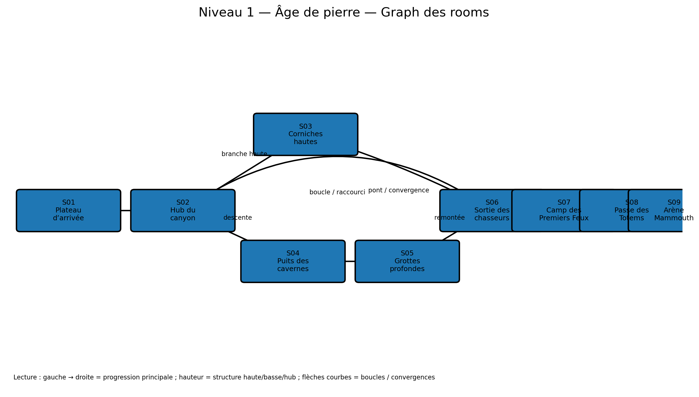

# Niveau 1 — Âge de pierre : Le Canyon des Premiers Feux

**ID d’ère :** `stone`  
**Boss :** `mammoth_chief`  
**Élite actuelle :** `mammoth_rider`  
**Grammaire de traversal :** descendre volontairement, explorer les cavités, remonter par une boucle  
**Prérequis :** `00_pre_requis_systeme_niveaux.md`

---

## Visualisation du graph des rooms



## 1. Intention

Le premier niveau doit apprendre immédiatement que les fosses ne sont pas toutes des échecs. Certaines ouvrent une route basse. La carte introduit sans surcharge :

- une bifurcation claire ;
- une branche haute simple ;
- une branche basse plus dangereuse ;
- une boucle de retour ;
- une première interaction destructible ;
- une liane grimpable ;
- un encounter verrouillé ;
- un marchand en zone neutre ;
- une arène de boss illustrée.

Le niveau reste le plus lisible des six. Sa complexité vient de la topologie, pas du nombre de gadgets.

---

## 2. Paramètres globaux

```js
{
  id: 'stone',
  tilesW: 354,
  worldH: 32,
  startRoom: 'S01_PLATEAU',
  bossAnteRoom: 'S08_TOTEM_PASS',
  bossArenaRoom: 'S09_MAMMOTH_ARENA',
  fallDamageRatio: 0.10,
  mainPathTargetSeconds: 170,
  completionTargetSeconds: 260,
}
```

- chemin principal : environ 245 tuiles effectives ;
- complétion avec branches : environ 320 tuiles ;
- densité moyenne : faible à moyenne ;
- maximum simultané Normal : 5 ;
- marchand : après convergence des deux branches ;
- secrets : 3 ;
- élite obligatoire : 1 ;
- élite optionnelle : 1.

---

## 3. Graphe

```text
S01 Plateau d’arrivée
  -> S02 Hub du canyon
       -> S03 Corniches hautes --------\
       -> S04 Puits des cavernes -> S05 Grottes profondes
                                      \-> S06 Sortie des chasseurs
S03 -----------------------------------> S06
S06 -> S07 Camp des Premiers Feux -> S08 Passe des Totems -> S09 Arène
```

Boucle : la sortie des grottes rejoint les corniches puis permet de revenir au hub par une corniche one-way.

---

## 4. Rooms

| ID | X (`tx`) | Bande Y | Fonction | Contenu essentiel |
|---|---:|---:|---|---|
| `S01_PLATEAU` | 0–24 | 18–31 | entrée | tutoriel déplacement, 2 ennemis max |
| `S02_CANYON_HUB` | 24–72 | 15–31 | hub/choix | encounter court, vue sur route haute et puits |
| `S03_UPPER_RIDGE` | 68–132 | 8–22 | branche haute | lianes, frondeurs, coffre mouvement |
| `S04_CAVE_SHAFT` | 66–104 | 19–31 | descente | chute contrôlée, chauves-souris |
| `S05_DEEP_CAVES` | 96–154 | 21–31 | branche basse | faible lumière, mur friable, élite optionnelle |
| `S06_HUNTERS_EXIT` | 146–184 | 13–29 | convergence/boucle | remontée, raccourci vers hub |
| `S07_FIRST_FIRE_CAMP` | 184–212 | 17–31 | safe room | marchand, coffre, autel visuel |
| `S08_TOTEM_PASS` | 212–320 | 12–31 | montée de tension | chasse, encounter élite, antichambre |
| `S09_MAMMOTH_ARENA` | 320–354 | 8–31 | boss | image dédiée, charge et stomp |

---

## 5. Géométrie détaillée

### S01 — Plateau d’arrivée

- sol principal `ty=22`, largeur 24 ;
- deux marches de 1 tuile entre `tx=14` et `tx=18` ;
- aucun trou ;
- un rocher de décor en arrière-plan, non collisionnant ;
- safe respawns : `(3,22)`, `(18,21)` ;
- sortie par marche vers le hub.

Encounter :

```text
stone_spear ×1
puis stone_slinger ×1 à tx≈20
```

But : présenter mêlée puis projectile sans verrouiller la room.

### S02 — Hub du canyon

- vaste cuvette : sol descendant de `ty=20` à `ty=23`, puis remontant ;
- route haute visible à `ty=14–17` ;
- puits de grotte visible entre `tx=61–66` ;
- le puits reçoit un langage visuel « sûr » : torches, os orientés, courant d’air ;
- une fosse mortelle différente est placée plus loin avec pics/obscurité afin d’éviter l’ambiguïté.

Encounter `E_STONE_HUB` :

- fermeture par barrières d’os ;
- vague 1 : `stone_spear ×2` ;
- vague 2 : `stone_slinger ×1` + `beast_hunter ×1` ;
- récompense : 12–18 or ;
- après clear, les deux branches sont pleinement accessibles.

### S03 — Corniches hautes

- accès via liane `CLIMB_STONE_01`, hauteur 5 tuiles ;
- alternance de plateformes de 4–7 tuiles ;
- aucun gap supérieur à 4 tuiles sur le chemin principal ;
- deux postes de frondeurs avec ligne de vue, mais couverture rocheuse intermédiaire ;
- coffre haut sur une corniche nécessitant double saut ;
- sortie vers `S06` par pont d’os fragile.

Pont :

- supporte 1,2 s après premier passage ;
- s’effondre ensuite ;
- la chute ramène vers la route basse, jamais dans le vide ;
- se réinitialise uniquement au rechargement du niveau.

### S04 — Puits des cavernes

- chute de 6 tuiles avec trois rebords ;
- le joueur peut descendre par rebonds ou tomber directement ;
- caméra descend progressivement ;
- aucun ennemi terrestre au point d’atterrissage ;
- `stone_cave_bats` activées après franchissement de la moitié du puits ;
- safe respawn au bas du puits.

### S05 — Grottes profondes

- plafond collisionnant à `ty≈20–22` ;
- sol irrégulier `ty=27–29` ;
- largeur de combat minimale : 12 tuiles ;
- éclairage plus sombre, silhouettes ennemies rehaussées ;
- deux embranchements :
  - principal vers `S06` ;
  - mur friable vers secret `SEC_STONE_01`.

Secret `SEC_STONE_01` :

- mur à 45 PV ;
- fissures + poussière + os dirigés vers le mur ;
- derrière : autel tribal, coffre relique 25 % ou coffre haut garanti ;
- option Cauchemar : `stone_cave_stalker` élite.

Encounter bas :

- `stone_cave_stalker ×1` ;
- `war_shaman ×1` sur une alcôve ;
- `stone_spear ×1–2`.

### S06 — Sortie des chasseurs

- liane de 7 tuiles et deux paliers ;
- en haut, levier ouvrant un raccourci vers `S02` ;
- raccourci one-way initialement fermé par tronc ;
- sortie commune des routes haute/basse ;
- aucun encounter verrouillé afin de créer une respiration.

### S07 — Camp des Premiers Feux

- sol plat 28 tuiles ;
- `NO_ENEMY` sur toute la room ;
- marchand au centre ;
- coffre normal à droite ;
- feu central purement visuel ;
- portail de retour absent : progression uniquement vers la droite ;
- lisière gauche bloque les projectiles de la room précédente.

### S08 — Passe des Totems

Trois sous-séquences :

1. **chasse ouverte** `tx=212–248`
   - beast hunters rapides ;
   - un frondeur en hauteur ;
   - arbres couchés comme petits couverts.

2. **enclos du mammouth** `tx=248–286`
   - encounter verrouillé ;
   - `mammoth_rider` élite obligatoire ;
   - deux `stone_spear` maximum en renfort ;
   - grande largeur afin de télégraphier la charge.

3. **antichambre** `tx=286–320`
   - aucun ennemi ;
   - montée douce ;
   - deux totems monumentaux ;
   - coffre de préparation à 20 % ;
   - porte d’arène visible avant entrée.

---

## 6. Nouveaux ennemis requis

### `stone_cave_stalker`

- comportement de base : `assassin` adapté au sol ;
- neutral : tapi, faible vitesse ;
- wind-up : 0,45 s, dos arqué et poussière ;
- attaque : bond de 4–6 tuiles ;
- dégâts : 12 ;
- ne traverse pas les murs ;
- cooldown minimal : 1,8 s ;
- fallback si asset absent : `beast_hunter`.

### `stone_cave_bats`

- comportement : `flyer`, petit essaim ;
- neutral : suspendu ou flottement lent ;
- wind-up : 0,35 s ;
- attaque : piqué unique puis remontée ;
- maximum simultané : 3 ;
- fallback : `war_shaman` sans changement de géométrie.

---

## 7. Secrets

| ID | Type | Accès | Récompense |
|---|---|---|---|
| `SEC_STONE_01` | mur friable | grottes | coffre/relique |
| `SEC_STONE_02` | maîtrise mouvement | corniche au-dessus du pont | coffre haut |
| `SEC_STONE_03` | boucle | retour vers hub après levier | cache d’or + raccourci |

---

## 8. Arène du Chef Mammouth

### Art

```text
assets/arenas/stone_boss_arena.png
```

Image attendue :

- enclos tribal monumental ;
- falaises et pieux en arrière-plan ;
- sol terreux très lisible ;
- silhouettes de mammouths/tribu au fond ;
- aucun pieu visuel confondu avec un obstacle réel ;
- centre visuellement ouvert pour les charges.

### Gameplay

- rectangle : `tx=320–354` ;
- sol principal `ty=23` ;
- deux petits promontoires one-way : 3 tuiles de large, `ty=19`, aux quarts gauche/droit ;
- ils servent à tirer à l’arc mais ne sont pas permanemment sûrs ;
- charge du boss peut briser le promontoire touché pendant 6 s ;
- aucun plafond ;
- porte gauche fermée au trigger ;
- limite droite solide et visible.

### Compatibilité des patterns

- `charge` : ligne centrale de 24 tuiles dégagée ;
- `stomp` : plateformes assez basses pour que l’onde reste lisible ;
- `rocks` : points de chute calculés via `surfaceYAt` ;
- `summon` : deux points de spawn latéraux hors caméra immédiate.

### Rythme recommandé

- phase 1 : charge/stomp, apprentissage de l’espace ;
- phase 2 : rocks + hunters, promontoires temporairement détruits ;
- pas de hazard permanent ;
- portail après mort au centre de l’arène.

---

## 9. Données de spawn recommandées

```js
encounters: [
  { id: 'E_STONE_HUB', roomId: 'S02_CANYON_HUB', budget: [2, 3.25] },
  { id: 'E_STONE_CAVES', roomId: 'S05_DEEP_CAVES', budget: [3.5] },
  { id: 'E_STONE_ELITE', roomId: 'S08_TOTEM_PASS', fixed: ['mammoth_rider'] },
]
```

Spawns libres entre encounters :

- 8 à 11 packs ;
- pack moyen Normal : 1,8 ennemi ;
- aucune artillerie ;
- au plus un caster par écran ;
- au moins 6 tuiles entre un spawn et un bord de fosse.

---

## 10. IA de démonstration

Route principale par défaut :

```text
S01 -> S02 -> S03 -> S06 -> S07 -> S08 -> S09
```

Route d’exploration si HP > 55 % :

```text
S01 -> S02 -> S04 -> S05 -> S06 -> ...
```

Actions particulières :

- reconnaître `CAVE_SHAFT` comme chute volontaire ;
- ne pas tenter de remonter le puits par sa paroi ;
- attendre la fin de l’effondrement du pont avant nouvelle tentative ;
- utiliser la liane par waypoint ;
- en boss, ne pas camper sur un promontoire détruit.

Test : 30 seeds × difficultés Normal/Difficile, zéro blocage de plus de 4 s.

---

## 11. Assets à produire

- `stone_boss_arena.png` ;
- variante cave des textures de sol/plafond ;
- liane ;
- mur friable intact/fissuré/cassé ;
- pont d’os intact/cassé ;
- barrière d’os d’encounter ;
- icône/prompt de levier tribal ;
- sprites des deux nouveaux ennemis si retenus ;
- métadonnées de collision et de navgraph.

---

## 12. Changements de code spécifiques

- renderer de plafond/caverne dans `level.js` ;
- props `vine`, `bone_bridge`, `breakable_rock`, `tribal_gate` ;
- état de pont fragile ;
- lumière locale de grotte facultative ;
- comportement `cave_stalker` si non mappé sur `assassin` ;
- spawn suspendu pour les chauves-souris.

---

## 13. Critères d’acceptation

- [ ] Le joueur comprend visuellement que le puits principal est explorable.
- [ ] La route haute et la route basse rejoignent `S06`.
- [ ] La route principale ne nécessite pas de casser le mur secret.
- [ ] Aucun spawn ne se produit au point d’atterrissage du puits.
- [ ] Le marchand est protégé.
- [ ] Le mammoth rider dispose d’au moins 18 tuiles pour charger.
- [ ] Les plateformes de boss n’offrent pas une zone invulnérable.
- [ ] Les rochers du boss ciblent le bon support.
- [ ] Le mode démo franchit les deux routes.
- [ ] Temps cible Normal : 2 min 30 à 4 min 30.
