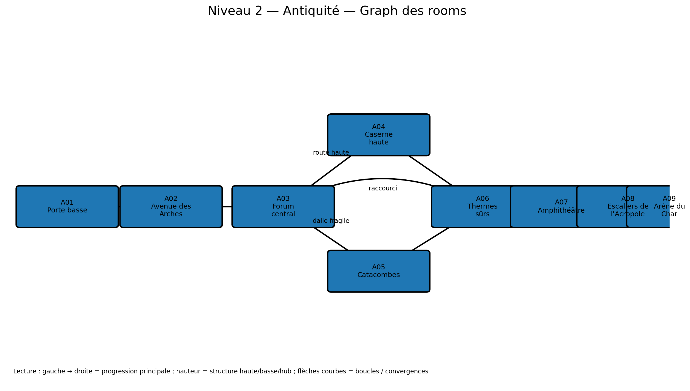

# Niveau 2 — Antiquité : L’Acropole des Légions Perdues

**ID d’ère :** `antiquity`  
**Boss :** `chariot_commander`  
**Élite actuelle :** `temple_guardian`  
**Grammaire de traversal :** monter par escaliers monumentaux, contourner par ruines et catacombes  
**Prérequis :** `00_pre_requis_systeme_niveaux.md`

---

## Visualisation du graph des rooms



## 1. Intention

Le niveau 2 introduit une architecture construite. La verticalité n’est plus naturelle : elle est organisée par terrasses, escaliers, arches, galeries et dalles. Le joueur doit lire :

- les lignes de vue des archers ;
- les formations de boucliers ;
- une route haute exposée ;
- une route basse confinée ;
- des dalles fragiles vers les catacombes ;
- une grande place centrale servant de boucle ;
- une arène de char large et lisible.

---

## 2. Paramètres

```js
{
  id: 'antiquity',
  tilesW: 378,
  startRoom: 'A01_LOWER_GATE',
  bossAnteRoom: 'A08_ACROPOLIS_STEPS',
  bossArenaRoom: 'A09_CHARIOT_ARENA',
  fallDamageRatio: 0.11,
  mainPathTargetSeconds: 185,
  completionTargetSeconds: 285,
}
```

- route principale : 270 tuiles effectives ;
- branches : caserne haute et catacombes ;
- marchand : thermes abandonnés après la boucle ;
- secret de dalle fragile ;
- encounter majeur : forum ;
- arène : 38 tuiles de large.

---

## 3. Graphe

```text
A01 Porte basse -> A02 Avenue des Arches -> A03 Forum central
                                      /          \
                            A04 Caserne haute   A05 Catacombes
                                      \          /
                                       A06 Thermes sûrs
                                              |
                                       A07 Amphithéâtre élite
                                              |
                                       A08 Escaliers de l’Acropole
                                              |
                                       A09 Arène du Char
```

La sortie de la catacombe débouche derrière une porte du forum et crée un raccourci durable.

---

## 4. Rooms

| ID | X | Y | Fonction |
|---|---:|---:|---|
| `A01_LOWER_GATE` | 0–28 | 18–31 | entrée |
| `A02_ARCHES_AVENUE` | 28–78 | 14–31 | lignes de vue |
| `A03_FORUM` | 78–142 | 12–31 | hub + encounter |
| `A04_BARRACKS` | 126–190 | 7–20 | route haute |
| `A05_CATACOMBS` | 116–202 | 23–31 | route basse |
| `A06_BATHS_SAFE` | 194–226 | 16–31 | marchand |
| `A07_AMPHITHEATER` | 226–290 | 13–31 | élite |
| `A08_ACROPOLIS_STEPS` | 290–340 | 8–31 | antichambre |
| `A09_CHARIOT_ARENA` | 340–378 | 8–31 | boss |

---

## 5. Room-by-room

### A01 — Porte basse

- sol `ty=23` ;
- trois marches de 1 tuile ;
- hoplite isolé, puis archer ;
- statue cassée servant de couverture ;
- pas de verrouillage.

### A02 — Avenue des Arches

- arches au premier plan non collisionnantes ;
- deux niveaux :
  - voie basse `ty=22–24` ;
  - balcon `ty=15–17` ;
- rampes via colonnes effondrées ;
- archers sur balcon ;
- un hoplite protège un archer au sol pour introduire la synergie bouclier/tireur ;
- les flèches ne doivent pas traverser les colonnes solides.

Secret mouvement :

- saut depuis une colonne inclinée vers un balcon latéral ;
- coffre haut ;
- retour one-way vers l’avenue.

### A03 — Forum central

- place de 42 tuiles de large ;
- fontaine sèche centrale, collision basse ;
- sorties visibles vers caserne et catacombes ;
- encounter verrouillé `E_ANTIQUITY_FORUM`.

Vagues :

1. `hoplite ×2` + `archer_auxilia ×1` ;
2. `desert_raider ×2` ;
3. Difficile/Cauchemar : `antiquity_spear_sentinel ×1`.

Après clear :

- porte de caserne ouverte ;
- dalle fissurée de catacombe activable ;
- deux choix équivalents.

### A04 — Caserne haute

- escaliers et terrasses ;
- hauteur maximale `ty=9` ;
- route exposée aux archers ;
- balustrades visuelles non solides sauf segments indiqués ;
- salle d’armes avec caisse destructible ;
- `temple_guardian` non élite en fin de branche sur difficultés supérieures ;
- descente par escalier arrière vers les thermes.

Mécanique :

- porte de bronze activée par levier ;
- ouverture lente 1,0 s ;
- aucun ennemi ne peut spawn pendant l’animation.

### A05 — Catacombes

- accès par dalle fragile dans le forum ;
- chute de 4 tuiles ;
- plafond bas, largeur 8–14 tuiles ;
- alcôves funéraires ;
- `antiquity_catacomb_shade` apparaît depuis une alcôve signalée ;
- porte secrète vers cache de butin ;
- sortie par escalier secondaire vers les thermes.

Hazard :

- dalles de pointes facultatives, cycle lent 1,6 s ;
- télégraphe 0,55 s ;
- dégâts 8 % PV max ;
- jamais deux dalles consécutives sur la route principale.

### A06 — Thermes sûrs

- safe room ;
- marchand ;
- bassin vide comme séparation visuelle ;
- coffre normal ;
- raccourci vers le forum déverrouillé depuis l’intérieur ;
- aucune régénération gratuite.

### A07 — Amphithéâtre

- arène intermédiaire elliptique simulée par gradins ;
- largeur de combat 34 tuiles ;
- fermeture de deux herses ;
- élite obligatoire : `temple_guardian` ;
- renforts : un archer par balcon, jamais plus de deux ;
- victoire ouvre la porte de l’acropole.

### A08 — Escaliers de l’Acropole

- montée de 10 tuiles verticales sur 50 tuiles horizontales ;
- paliers de 6–8 tuiles ;
- deux micro-packs, pas d’encounter verrouillé ;
- dernier palier vide ;
- vue complète de l’arène du char ;
- coffre de préparation possible à 20 %.

---

## 6. Nouveaux ennemis

### `antiquity_spear_sentinel`

- base : `charger` léger ;
- neutral : garde statique ;
- wind-up : lance abaissée, 0,55 s ;
- attaque : rush de 6 tuiles ;
- peut être interrompu par coup chargé ;
- ne tourne pas pendant le rush ;
- fallback : `desert_raider`.

### `antiquity_catacomb_shade`

- base : `assassin` spectral ;
- neutral : errance lente ;
- wind-up : lueur 0,50 s ;
- attaque : dash traversant court + onde de 2 tuiles ;
- pas de collision avec petites props, mais respecte murs ;
- fallback : `desert_raider` avec palette/particules.

---

## 7. Secrets

| ID | Accès | Récompense |
|---|---|---|
| `SEC_ANTI_01` | balcon de l’avenue | coffre haut |
| `SEC_ANTI_02` | porte funéraire en catacombes | relique ou potion |
| `SEC_ANTI_03` | raccourci thermes/forum | cache d’or |

---

## 8. Arène du Commandant de Char

### Art

```text
assets/arenas/antiquity_boss_arena.png
```

Composition :

- hippodrome/acropole ;
- gradins au fond ;
- statues et bannières ;
- sol clair, poussière visible ;
- deux colonnes brisées en bordure ;
- aucune marche visuelle au centre.

### Gameplay

- `tx=340–378`, sol `ty=23` ;
- largeur de charge utile : 31 tuiles ;
- deux petites rampes aux extrémités, hauteur 1 tuile ;
- pas de plateformes hautes permanentes ;
- deux niches latérales de spawn ;
- barrières fermées au début.

Compatibilité :

- `sweep` : centre libre ;
- `javelins` : couvertures latérales limitées, destructibles après deux impacts ;
- summons : apparaissent derrière le char, jamais sur le joueur ;
- phase 2 : vitesse accrue, couvertures détruites.

Le décor ne doit pas masquer les roues ni la direction du char.

---

## 9. Encounters et budgets

- forum : budgets `4.25`, puis `2.0–3.0` ;
- catacombes : trois micro-packs de `2.0–3.5` ;
- caserne : deux packs de `3.0–4.5` ;
- amphithéâtre : élite fixe + budget renfort 2.5 ;
- densité hors room : 7–9 packs.

Règles :

- au moins 9 tuiles entre deux archers sur plateformes opposées ;
- maximum deux boucliers simultanés en Normal ;
- ne pas combiner elephant guard avec temple guardian hors Cauchemar.

---

## 10. IA de démonstration

Route par défaut : caserne haute.  
Route alternative si build distance dominant : catacombes, moins de longues lignes de vue.

Actions :

- marcher sur la dalle fragile et attendre la rupture ;
- ne pas tenter de remonter par le trou ;
- utiliser leviers ;
- choisir couverture contre archers ;
- attendre l’ouverture complète de la porte de bronze ;
- dans l’arène, ne pas se coincer contre les rampes latérales.

Tests : 30 seeds, 2 routes, aucun stuck ; temps max d’attente à une porte 2,5 s.

---

## 11. Assets

- arène du char ;
- escaliers/terrasses ;
- colonne inclinée collisionnante ;
- dalle fragile 3 états ;
- porte de bronze ;
- herse ;
- pointes ;
- alcôves funéraires ;
- fontaine sèche ;
- nouveaux ennemis.

---

## 12. Changements spécifiques

- rampe/escaliers rasterisés proprement ;
- dalle fragile ;
- hazard pointes ;
- porte de bronze animée ;
- collision de couvertures destructibles dans l’arène ;
- shade spectral ;
- spawn de balcon.

---

## 13. Acceptation

- [ ] Les deux routes sont identifiables depuis le forum.
- [ ] Les archers ne tirent pas à travers les colonnes solides.
- [ ] La dalle de catacombe ne ressemble pas à une fosse mortelle.
- [ ] Le raccourci des thermes revient au forum.
- [ ] L’amphithéâtre verrouille et libère correctement les portes.
- [ ] L’arène laisse au char 31 tuiles de course.
- [ ] Le mode démo utilise les leviers et la dalle.
- [ ] Temps cible : 3 à 5 minutes.
