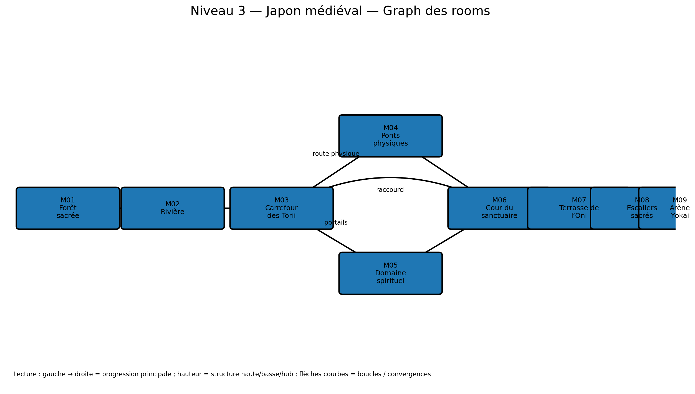

# Niveau 3 — Japon médiéval : Le Sanctuaire entre Deux Mondes

**ID d’ère :** `medieval`  
**Boss :** `yokai_lord`  
**Élite actuelle :** `oni_brute`  
**Grammaire de traversal :** ponts, ascension, poches spirituelles et portails courts  
**Prérequis :** `00_pre_requis_systeme_niveaux.md`

---

## Visualisation du graph des rooms



## 1. Intention

Ce niveau doit être le plus poétique et le plus fluide. Il combine :

- forêt basse ;
- rivière et ponts ;
- ascension vers un sanctuaire ;
- route physique ;
- route spirituelle ;
- téléporteurs courts ;
- brume révélant un passage ;
- cour centrale ;
- boss flottant dans une arène rituelle.

La lisibilité des téléporteurs est prioritaire : même couleur, même son, mêmes particules, direction suggérée.

---

## 2. Paramètres

```js
{
  id: 'medieval',
  tilesW: 364,
  startRoom: 'M01_SACRED_FOREST',
  bossAnteRoom: 'M08_SHRINE_STAIRS',
  bossArenaRoom: 'M09_YOKAI_ARENA',
  fallDamageRatio: 0.10,
  mainPathTargetSeconds: 180,
  completionTargetSeconds: 280,
}
```

- route physique légèrement plus simple ;
- route spirituelle plus courte mais plus dangereuse ;
- marchand dans cour commune ;
- 3 portails courts maximum obligatoires ;
- 1 portail secret.

---

## 3. Graphe

```text
M01 Forêt -> M02 Rivière -> M03 Carrefour des Torii
                              /                 \
                    M04 Ponts physiques     M05 Domaine spirituel
                              \                 /
                               M06 Cour du sanctuaire
                                         |
                               M07 Terrasse de l’Oni
                                         |
                               M08 Escaliers sacrés
                                         |
                               M09 Arène Yōkai
```

---

## 4. Rooms

| ID | X | Y | Fonction |
|---|---:|---:|---|
| `M01_SACRED_FOREST` | 0–34 | 17–31 | entrée |
| `M02_RIVER_PATH` | 34–82 | 16–31 | ponts simples |
| `M03_TORII_CROSSROADS` | 82–126 | 12–31 | hub |
| `M04_PHYSICAL_BRIDGES` | 120–190 | 8–25 | route physique |
| `M05_SPIRIT_POCKETS` | 116–202 | 7–30 | route spirituelle |
| `M06_SHRINE_COURT` | 198–236 | 14–31 | safe room |
| `M07_ONI_TERRACE` | 236–292 | 10–31 | élite |
| `M08_SHRINE_STAIRS` | 292–330 | 7–31 | antichambre |
| `M09_YOKAI_ARENA` | 330–364 | 6–31 | boss |

---

## 5. Détail

### M01 — Forêt sacrée

- terrain doux `ty=21–23` ;
- bambous en arrière-plan ;
- ronin isolé ;
- premier ninja assassin dans une zone large ;
- pétales et brume légers ;
- aucun portail.

### M02 — Rivière

- trois petits ponts de 4–7 tuiles ;
- eau = hazard non mortel, renvoie au dernier bord et inflige 8 % PV ;
- plateformes de pierre ;
- tengu archer sur rive opposée ;
- passage inférieur secret derrière cascade.

Secret cascade :

- opacité réduite lorsque le joueur est proche ;
- petite alcôve avec coffre ;
- aucun combat obligatoire.

### M03 — Carrefour des Torii

- deux torii majeurs signalent les routes ;
- route physique à droite/haut ;
- route spirituelle via portail violet/rose ;
- encounter court avant choix :
  - `ronin ×1`
  - `spirit_caster ×1`
  - `ninja_assassin ×1` en seconde vague.

### M04 — Ponts physiques

- pont suspendu principal de 14 tuiles ;
- oscillation visuelle uniquement en V1 ;
- deux plateformes naturelles ;
- racine/liane grimpable ;
- archers tengu avec couvertures ;
- `medieval_bamboo_stalker` dans une section de bambou ;
- sortie par passerelle vers la cour.

Le pont ne doit pas s’effondrer : la route physique est la route fiable.

### M05 — Domaine spirituel

Trois poches reliées par téléporteurs :

1. poche basse, combat caster ;
2. poche haute, mouvement ;
3. poche de sortie, mini-encounter.

Chaque portail :

- interaction `E` ;
- destination visible sous forme de silhouette/hologramme ;
- cooldown 0,75 s ;
- orientation de sortie vers le chemin.

Hazard :

- brume profonde masquant le bord ;
- lanternes au sol tous les 3–4 tuiles ;
- aucune chute obligatoire sans visibilité.

### M06 — Cour du sanctuaire

- safe room ;
- marchand ;
- bassin et cloche ;
- raccourci ouvrable vers M03 ;
- coffre normal ;
- portail spirituel secret vers une petite plateforme récompense.

### M07 — Terrasse de l’Oni

- terrasse 30 tuiles ;
- encounter élite :
  - `oni_brute` ;
  - un tengu sur balcon ;
  - deux lantern wisps en phase 2 si disponibles.
- piliers destructibles visuels, mais collision basse seulement ;
- clear ouvre les escaliers.

### M08 — Escaliers sacrés

- montée de 8 tuiles ;
- alternance de paliers et torii ;
- aucun ennemi dans les 14 dernières tuiles ;
- météo pétales renforcée ;
- vue de l’arène ;
- sauvegarde du safe respawn avant la porte.

---

## 6. Nouveaux ennemis

### `medieval_lantern_wisp`

- `flyer`/`caster` ;
- neutral : flottement ;
- wind-up : grossissement lumineux 0,60 s ;
- attaque : rayon court ou explosion radiale de 2,5 tuiles ;
- faible PV, priorité tactique ;
- maximum 2 en Normal ;
- fallback : `spirit_caster`.

### `medieval_bamboo_stalker`

- `assassin` ;
- neutral : camouflage partiel derrière bambou ;
- wind-up : sortie visible 0,40 s ;
- attaque : dash tranchant horizontal ;
- ne peut pas attaquer depuis hors caméra ;
- fallback : `ninja_assassin`.

---

## 7. Secrets

- cascade de M02 ;
- portail dissimulé dans M06 ;
- plateforme haute au-dessus de M04, accessible par racine + dash.

Récompenses : coffre, relique à faible chance, or.

---

## 8. Arène du Seigneur Yōkai

### Art

```text
assets/arenas/medieval_boss_arena.png
```

- sanctuaire nocturne ;
- lune, torii, lac/brume ;
- cercle rituel central ;
- plateformes de pierre clairement dessinées ;
- lanternes aux bords ;
- premier plan transparent limité.

### Gameplay

- `tx=330–364` ;
- sol central `ty=23`, 20 tuiles ;
- deux plateformes one-way latérales `ty=17`, largeur 4 ;
- vide visuel sous plateformes, mais sol technique hors champ pour projectiles ;
- boss flottant à `flyH≈150` ;
- deux portails de phase purement boss, non interactifs joueur.

Compatibilité :

- `blink` : quatre points authored, tous visibles ;
- `fireballs` : lignes de fuite entre plateformes ;
- `ring` : assez d’espace vertical ;
- summons : wisps aux extrémités ;
- aucune plateforme ne permet d’éviter entièrement les anneaux.

Phase event à 50 % :

- cercle rituel s’allume ;
- brume monte visuellement ;
- plateformes latérales se décalent verticalement de 1 tuile, transition 0,8 s ;
- collision mise à jour sans coincer le joueur.

---

## 9. Encounters

- route physique : budgets 3, 4, 3 ;
- route spirituelle : budgets 3.5, 4.5 ;
- terrasse oni : élite 5 + renfort 2.5 ;
- hors encounters : 7–9 micro-packs.

Règles :

- maximum un assassin + un archer simultanés dans une zone étroite ;
- spirit caster jamais derrière un portail de sortie ;
- wisps ne spawnent pas au-dessus du vide sans node de vol.

---

## 10. IA démo

Route par défaut : physique.  
Route spirituelle autorisée après validation des téléporteurs.

Exigences :

- interaction avec portails ;
- attendre le fondu avant nouvelle commande ;
- ne pas boucler entre deux portails ;
- mémoriser les portails déjà utilisés ;
- alignement précis sur racine grimpable ;
- boss : changement de plateforme si ring imminent.

Tests : 20 runs route physique + 20 route spirituelle.

---

## 11. Assets

- arène yōkai ;
- pont suspendu ;
- torii ;
- racine grimpable ;
- portail actif/inactif ;
- brume de passage ;
- cascade foreground ;
- cloche, bassin ;
- deux nouveaux ennemis.

---

## 12. Changements spécifiques

- téléporteur court ;
- eau non mortelle ;
- portail destination preview ;
- plateforme de boss mobile verticalement ;
- cache bamboo stalker ;
- occlusion cascade/brume.

---

## 13. Acceptation

- [ ] Les deux routes sont identifiables sans texte.
- [ ] Les trois portails spirituels ne créent aucune boucle involontaire.
- [ ] La route physique est toujours praticable.
- [ ] Le raccourci de cour revient au carrefour.
- [ ] L’oni dispose d’une zone de mêlée suffisante.
- [ ] Les blinks du boss utilisent uniquement des points sûrs.
- [ ] Le mode démo termine les deux routes.
- [ ] Temps cible : 3 à 5 minutes.
