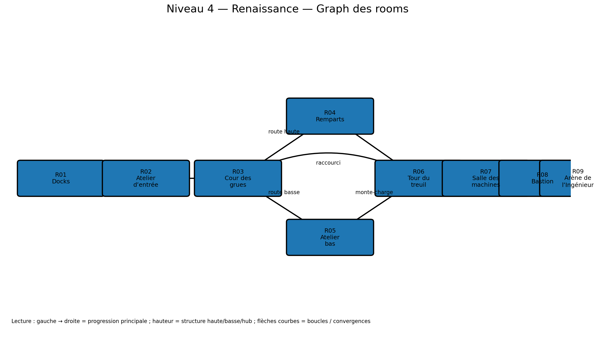

# Niveau 4 — Renaissance : La Citadelle des Machines

**ID d’ère :** `renaissance`  
**Boss :** `war_engineer`  
**Élite actuelle :** `armored_captain`  
**Grammaire de traversal :** treuils, ascenseurs, ateliers, remparts et machines activables  
**Prérequis :** `00_pre_requis_systeme_niveaux.md`

---

## Visualisation du graph des rooms



## 1. Intention

Premier niveau où l’environnement est activé volontairement. Le joueur doit :

- actionner une manivelle ;
- utiliser un ascenseur ;
- traverser un atelier bas ou des remparts hauts ;
- éviter les lignes de tir ;
- exploiter des barils explosifs ;
- ouvrir un pont-levis ;
- affronter un boss d’artillerie dans une cour fortifiée illustrée.

---

## 2. Paramètres

```js
{
  id: 'renaissance',
  tilesW: 386,
  startRoom: 'R01_DOCKS',
  bossAnteRoom: 'R08_BASTION_APPROACH',
  bossArenaRoom: 'R09_ENGINEER_ARENA',
  fallDamageRatio: 0.12,
  mainPathTargetSeconds: 195,
  completionTargetSeconds: 300,
}
```

---

## 3. Graphe

```text
R01 Docks -> R02 Atelier d’entrée -> R03 Cour des grues
                                      /              \
                              R04 Remparts       R05 Atelier bas
                                      \              /
                                       R06 Tour du treuil (safe)
                                                 |
                                       R07 Salle des machines
                                                 |
                                       R08 Bastion
                                                 |
                                       R09 Arène Ingénieur
```

---

## 4. Rooms

| ID | X | Y | Fonction |
|---|---:|---:|---|
| `R01_DOCKS` | 0–34 | 18–31 | entrée |
| `R02_WORKSHOP_GATE` | 34–86 | 15–31 | première manivelle |
| `R03_CRANE_COURT` | 86–138 | 10–31 | hub |
| `R04_RAMPARTS` | 132–208 | 6–21 | route haute |
| `R05_LOWER_WORKS` | 126–214 | 20–31 | route basse |
| `R06_WINCH_TOWER_SAFE` | 208–240 | 10–31 | marchand/lift |
| `R07_MACHINE_HALL` | 240–304 | 11–31 | puzzle + encounter |
| `R08_BASTION_APPROACH` | 304–350 | 9–31 | élite/antichambre |
| `R09_ENGINEER_ARENA` | 350–386 | 7–31 | boss |

---

## 5. Détail

### R01 — Docks

- sol à `ty=23` ;
- caisses et corde ;
- pikeman puis musketeer ;
- petit gap franchissable par saut simple ;
- baril explosif tutoriel placé loin du joueur.

### R02 — Atelier d’entrée

- porte fermée ;
- manivelle visible à l’étage bas ;
- interaction 0,7 s ;
- la porte se lève en 1,1 s ;
- encounter après ouverture, pas pendant ;
- bombardier placé avec ligne de fuite.

### R03 — Cour des grues

- grue centrale ;
- plateforme suspendue servant de lift horizontal court ;
- choix :
  - remparts via lift vertical ;
  - atelier bas via porte ouverte.
- encounter mixte avant activation de la grue.

### R04 — Remparts

- route haute, vent visuel ;
- créneaux comme couvertures ;
- musketeers espacés ;
- shield musketeer en sentinelle ;
- pont-levis partiellement relevé, franchi via mécanisme à mi-parcours ;
- secret sur cabine de grue.

### R05 — Atelier bas

- plafond, machines, engrenages ;
- gear servitors ;
- barils explosifs ;
- jets de vapeur temporisés ;
- chemin plus combatif mais protégé des tireurs ;
- sortie par monte-charge vers R06.

### R06 — Tour du treuil

- safe room sur deux étages ;
- marchand au niveau médian ;
- ascenseur principal reliant bas/haut ;
- raccourci vers R03 déverrouillé ;
- coffre normal ;
- l’ascenseur ne peut pas être bloqué par props.

### R07 — Salle des machines

Objectif : ouvrir la porte du bastion avec deux commandes.

- commande haute via plateformes ;
- commande basse après encounter ;
- ordre libre ;
- état affiché par deux lampes/roues ;
- lorsque les deux sont actives, grande porte s’ouvre.

Encounter :

- `armored_captain` non élite ou `gear_servitor ×2` ;
- `musketeer ×1` sur passerelle ;
- jets de vapeur coupés pendant la fermeture de portes pour éviter injustice.

### R08 — Bastion

- cour de 28 tuiles ;
- élite `armored_captain` ;
- deux bombardiers maximum ;
- après clear, couloir vide de 14 tuiles ;
- vue sur arène ;
- coffre de préparation possible.

---

## 6. Nouveaux ennemis

### `renaissance_shield_musketeer`

- base `shield` + tir ;
- avance bouclier levé ;
- wind-up : met en joue 0,65 s, bouclier abaissé ;
- tir unique ;
- fenêtre de vulnérabilité pendant visée ;
- ne tire pas si allié proche sur trajectoire ;
- fallback : `musketeer` + `hoplite` non souhaité mais fonctionnel.

### `renaissance_gear_servitor`

- base `brute` ;
- patrouille lente ;
- wind-up : bras déployés 0,55 s ;
- attaque circulaire rayon 1,8 tuile ;
- faible knockback ;
- sensible aux barils ;
- fallback : `armored_captain` réduit.

---

## 7. Hazards et machines

### Vapeur

- cycle 2,2 s ;
- télégraphe 0,6 s ;
- actif 0,7 s ;
- dégâts 10 ;
- knockback léger ;
- désactivation locale par vanne possible pour un secret.

### Barils

- 1 PV ou hit explicite ;
- explosion rayon 2,2 tuiles ;
- dégâts alliés/ennemis conservant le principe de tir ami ;
- chaîne limitée à 3 barils ;
- pas de baril à moins de 4 tuiles d’un safe respawn.

---

## 8. Secrets

- cabine haute de grue : coffre haut ;
- vanne coupant la vapeur : salle d’armement ;
- plateforme sous pont-levis : cache d’or.

---

## 9. Arène de l’Ingénieur de Guerre

### Art

```text
assets/arenas/renaissance_boss_arena.png
```

- cour de forteresse ;
- grues, canons, atelier au fond ;
- ciel clair/fumée ;
- sol pavé lisible ;
- deux machines latérales.

### Gameplay

- `tx=350–386`, sol `ty=23` ;
- deux plateformes de maintenance `ty=17`, largeur 4 ;
- machines latérales deviennent des points de mortier, non couvertures ;
- trois zones de télégraphe possibles au sol ;
- un petit rail central visuel mais non collisionnant.

Compatibilité :

- `volley` : couvertures basses temporaires ;
- `mortars` : `surfaceYAt` sur sol ou plateforme ;
- `charge` phase 2 : voie centrale de 22 tuiles ;
- summon musketeer : plateformes latérales ;
- aucun point sûr permanent.

Phase 2 :

- une plateforme latérale descend ;
- jets de vapeur apparaissent aux extrêmes, jamais simultanément ;
- le centre reste toujours praticable.

---

## 10. Encounters

- atelier entrée : budget 3 ;
- cour grue : 4.5 ;
- remparts : 3 micro-packs ;
- atelier bas : 3 micro-packs + hazard ;
- machine hall : 5.5 ;
- bastion : élite 5 + renfort 2.5.

Maximum :

- deux musketeers par écran ;
- un bombardier si un hazard actif ;
- pas de mortar crew dans un espace inférieur à 16 tuiles.

---

## 11. IA démo

Actions obligatoires :

- interagir avec manivelle ;
- attendre porte ;
- appeler et attendre ascenseur ;
- monter/descendre avec plateforme ;
- activer deux commandes dans n’importe quel ordre ;
- éviter vapeur ;
- exploiter baril seulement si trajectoire sûre.

Route par défaut : remparts.  
Route alternative : atelier bas pour builds mêlée.

Test : zéro attente d’ascenseur > 4 s ; zéro boucle entre commandes.

---

## 12. Assets

- arène ;
- grue ;
- treuil ;
- ascenseurs ;
- pont-levis ;
- portes ;
- commandes/indicateurs ;
- vapeur ;
- barils ;
- nouveaux ennemis.

---

## 13. Changements spécifiques

- plateformes mobiles horizontales et verticales ;
- carry physics ;
- manivelles et commandes liées ;
- hazard vapeur ;
- barils chaînés ;
- portes animées ;
- arène phase events.

---

## 14. Acceptation

- [ ] Les routes haute et basse se reconnectent.
- [ ] L’ascenseur ne jitter pas.
- [ ] Le joueur ne peut pas être écrasé.
- [ ] Les deux commandes ouvrent la porte une seule fois.
- [ ] Les barils respectent le tir ami.
- [ ] La vapeur est toujours télégraphiée.
- [ ] L’arène conserve une route sûre temporaire.
- [ ] L’IA de démo utilise tous les mécanismes.
- [ ] Temps cible : 3 min 15 à 5 min.
