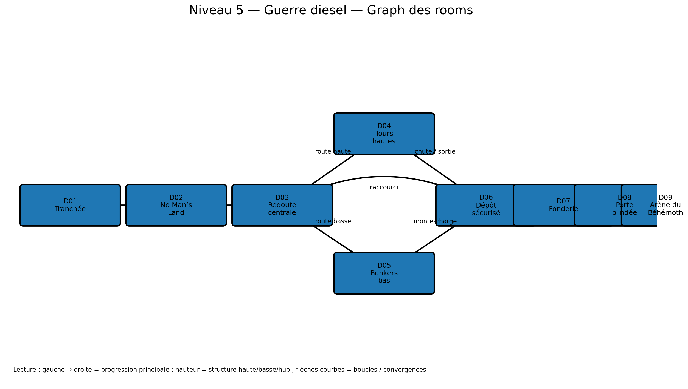

# Niveau 5 — Guerre diesel : Le Front des Forges Noires

**ID d’ère :** `diesel`  
**Boss :** `diesel_behemoth`  
**Élite actuelle :** `roller_scout`  
**Grammaire de traversal :** tranchées basses, bunkers, tunnels, tours et passerelles métalliques  
**Prérequis :** `00_pre_requis_systeme_niveaux.md`

---

## Visualisation du graph des rooms



## 1. Intention

Le niveau doit être oppressant sans devenir illisible. Il alterne :

- tranchées confinées ;
- no man’s land exposé ;
- route haute par tours/passerelles ;
- route basse par bunkers/tunnels ;
- jets de vapeur et flammes ;
- portes blindées ;
- monte-charge industriel ;
- arène lourde où le boss blindé utilise charge, flammes et mortiers.

---

## 2. Paramètres

```js
{
  id: 'diesel',
  tilesW: 402,
  startRoom: 'D01_FRONT_TRENCH',
  bossAnteRoom: 'D08_ARMORED_GATE',
  bossArenaRoom: 'D09_BEHEMOTH_ARENA',
  fallDamageRatio: 0.13,
  mainPathTargetSeconds: 205,
  completionTargetSeconds: 315,
}
```

- densité élevée ;
- safe room bunker ;
- 2 routes ;
- hazards plus présents ;
- lumière/contraste renforcés malgré pluie/fumée.

---

## 3. Graphe

```text
D01 Tranchée -> D02 No Man’s Land -> D03 Redoute centrale
                                      /             \
                              D04 Tours hautes   D05 Bunkers bas
                                      \             /
                                       D06 Dépôt sécurisé
                                                |
                                       D07 Fonderie
                                                |
                                       D08 Porte blindée
                                                |
                                       D09 Arène Béhémoth
```

---

## 4. Rooms

| ID | X | Y | Fonction |
|---|---:|---:|---|
| `D01_FRONT_TRENCH` | 0–42 | 20–31 | entrée confinée |
| `D02_NO_MANS_LAND` | 42–98 | 15–31 | zone exposée |
| `D03_CENTRAL_REDOUBT` | 98–150 | 12–31 | hub |
| `D04_HIGH_TOWERS` | 144–226 | 6–22 | route haute |
| `D05_BUNKER_NETWORK` | 138–236 | 22–31 | route basse |
| `D06_SUPPLY_SAFE` | 232–264 | 17–31 | marchand |
| `D07_FOUNDRY` | 264–326 | 10–31 | hazard/encounter |
| `D08_ARMORED_GATE` | 326–364 | 11–31 | élite/antichambre |
| `D09_BEHEMOTH_ARENA` | 364–402 | 7–31 | boss |

---

## 5. Détail

### D01 — Tranchée

- largeur de couloir 8–14 tuiles ;
- parapets hauts de 2 tuiles ;
- trench soldiers ;
- introduction d’un flamethrower avec espace de retraite ;
- pluie visuelle atténuée dans la tranchée.

### D02 — No Man’s Land

- terrain cratérisé ;
- 4 couvertures solides basses ;
- bombardier/mortar télégraphié ;
- bunker sniper dans une meurtrière ;
- progression de couverture en couverture ;
- aucun fil barbelé invisible : collision et hazard clairement séparés.

Fil barbelé :

- ralentit 35 % ;
- dégâts 4 par seconde ;
- hauteur basse, franchissable par saut ;
- ne doit pas se superposer à un télégraphe de mortier.

### D03 — Redoute centrale

- encounter verrouillé ;
- choix route haute/basse après clear ;
- `armored_trooper ×1`, `trench_soldier ×2`, puis `roller_scout ×1` ;
- porte haute et trappe basse s’ouvrent simultanément.

### D04 — Tours hautes

- échelles métalliques ;
- passerelles ;
- snipers et tireurs ;
- vue sur la route basse ;
- plateformes roulantes courtes facultatives ;
- secret au sommet d’une tour ;
- risque de chute non mortelle vers D05, créant une boucle naturelle.

### D05 — Réseau de bunkers

- plafond bas ;
- portes étroites ;
- flamethrowers avec alcôves de repli ;
- steam rusher dans couloir long ;
- salle de munitions secrète ;
- sortie par monte-charge vers D06.

### D06 — Dépôt sécurisé

- safe room ;
- marchand ;
- coffre ;
- point de respawn fort ;
- porte coupe-feu bloquant projectiles ;
- raccourci vers redoute.

### D07 — Fonderie

- passerelles médianes ;
- coulées/vents de chaleur en arrière-plan ;
- jets de feu au sol ;
- encounter `E_DIESEL_FOUNDRY` ;
- vanne optionnelle permettant de réduire un hazard et ouvrir un secret.

Vagues :

1. `armored_trooper ×1` + `trench_soldier ×2` ;
2. `flamethrower ×1` + `roller_scout ×1` ;
3. Cauchemar : `diesel_steam_rusher ×1`.

### D08 — Porte blindée

- encounter élite dans un espace large ;
- `roller_scout` élite ou variante renforcée ;
- mortar crew en soutien distant, maximum 1 ;
- après clear, animation de porte 1,4 s ;
- antichambre vide avec sirène et silhouette du boss.

---

## 6. Nouveaux ennemis

### `diesel_bunker_sniper`

- comportement `ranged` stationnaire ;
- neutral : caché derrière meurtrière ;
- wind-up : ligne de visée 0,75 s ;
- attaque : tir précis, dégâts 16 ;
- vulnérable pendant visée ;
- ne tire pas si couverture solide ;
- fallback : `trench_soldier` ranged.

### `diesel_steam_rusher`

- comportement `charger` ;
- neutral : moteur au ralenti ;
- wind-up : vapeur 0,65 s ;
- charge 7–10 tuiles ;
- étourdi 1,0 s contre mur ;
- dégâts 18 ;
- fallback : `roller_scout`.

---

## 7. Hazards

### Fil barbelé
Décrit ci-dessus.

### Jet de feu

- télégraphe vapeur 0,65 s ;
- actif 0,8 s ;
- cycle 2,5 s ;
- dégâts 14 ;
- zone 1,5 × 3 tuiles ;
- désactivable par vanne pour une branche seulement.

### Vapeur

Même système que Renaissance, palette et dégâts adaptés.

---

## 8. Secrets

- sommet de tour : coffre haut ;
- dépôt de munitions bunker : or + potion ;
- vanne de fonderie : relique ou coffre.

---

## 9. Arène du Béhémoth Diesel

### Art

```text
assets/arenas/diesel_boss_arena.png
```

- usine militaire ouverte ;
- tuyaux, fumée, blindage ;
- porte monumentale ;
- sol acier/béton contrasté ;
- deux conduits latéraux.

### Gameplay

- `tx=364–402`, sol `ty=23` ;
- deux plateformes métalliques `ty=18`, 4 tuiles ;
- conduits latéraux activent flammes de bord ;
- centre large pour charge ;
- boss blindé : orientation très lisible.

Compatibilité :

- `charge` : 28 tuiles utiles ;
- `flames` : possibilités de saut/dash ;
- `mortars` : aucun faux sol ;
- `stomp` : plateformes pas assez hautes pour être sûres ;
- blindage frontal : espace permettant de passer derrière.

Phase 2 à 45 % :

- éclairage rouge ;
- un conduit active un jet, alternance gauche/droite ;
- plateforme opposée reste accessible ;
- jamais de mortier + deux jets simultanés en Normal.

---

## 10. Encounters

- tranchée : 3 micro-packs ;
- no man’s land : sniper + artillerie, budget 4 ;
- redoute : 5.5 ;
- tours : 3 packs ;
- bunkers : 3 packs ;
- fonderie : 6 ;
- porte : élite 5 + support 2.

Règles :

- un seul flamethrower dans couloir < 12 tuiles ;
- un seul sniper par écran ;
- maximum deux hazards actifs pendant un encounter ;
- mortar crew ne cible pas une plateforme mobile.

---

## 11. IA démo

Route par défaut :

- haute si build distance ;
- basse si build mêlée/HP élevé.

Actions :

- échelles ;
- chute contrôlée de tour vers bunker si nécessaire ;
- attente monte-charge ;
- contournement fil barbelé ;
- interruption du sniper ;
- activation de vanne optionnelle seulement si coût faible ;
- boss : chercher l’arrière pendant récupération.

Test : 40 runs, aucune boucle de cover ; aucun stuck contre porte blindée.

---

## 12. Assets

- arène ;
- tranchées ;
- meurtrières ;
- échelles ;
- passerelles ;
- barbelés ;
- portes blindées ;
- monte-charge ;
- jets de feu ;
- vanne ;
- nouveaux ennemis.

---

## 13. Changements spécifiques

- hazard ralentissant ;
- sniper stationnaire ;
- charge avec stun mur ;
- portes coupe-feu ;
- conduits de phase boss ;
- contraste dynamique pluie/fumée.

---

## 14. Acceptation

- [ ] Les deux routes se lisent depuis la redoute.
- [ ] Une chute de tour mène à une zone jouable, pas au vide.
- [ ] Le sniper expose une ligne de visée claire.
- [ ] Aucun flamethrower ne bloque seul un couloir sans échappatoire.
- [ ] La fonderie conserve une route sûre.
- [ ] Le boss peut être contourné malgré son blindage.
- [ ] Le mode démo gère échelles, monte-charge et hazards.
- [ ] Temps cible : 3 min 30 à 5 min 30.
