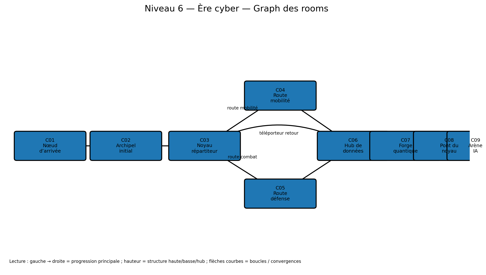

# Niveau 6 — Ère cyber : Les Îles du Noyau Céleste

**ID d’ère :** `cyber`  
**Boss :** `ai_overlord`  
**Élite actuelle :** `mech_assassin`  
**Grammaire de traversal :** plateformes flottantes, pads de propulsion, grav-lifts et téléporteurs  
**Prérequis :** `00_pre_requis_systeme_niveaux.md`

---

## Visualisation du graph des rooms



## 1. Intention

Dernier niveau : synthèse du kit de mobilité. Il doit paraître aérien, mais rester juste. Il impose :

- sauts et dashs fréquents ;
- plateformes flottantes ;
- chutes pénalisées mais non létales en Normal ;
- grav-lifts ;
- murs d’énergie ;
- téléporteurs ;
- ennemis volants ;
- route mobilité et route combat ;
- arène finale illustrée avec espace vertical.

Aucun saut obligatoire ne doit dépendre d’une compétence achetée.

---

## 2. Paramètres

```js
{
  id: 'cyber',
  tilesW: 364,
  startRoom: 'C01_ARRIVAL_NODE',
  bossAnteRoom: 'C08_CORE_BRIDGE',
  bossArenaRoom: 'C09_OVERLORD_ARENA',
  fallDamageRatio: 0.14,
  mainPathTargetSeconds: 190,
  completionTargetSeconds: 300,
  voidRespawnDelay: 0.45,
}
```

- 55 à 65 % du parcours sans sol continu ;
- plateformes principales largeur minimale 4 tuiles ;
- landing zones après dash ≥ 5 tuiles ;
- safe respawn à chaque île majeure.

---

## 3. Graphe

```text
C01 Nœud d’arrivée -> C02 Archipel initial -> C03 Noyau répartiteur
                                               /             \
                                      C04 Route mobilité   C05 Route défense
                                               \             /
                                                C06 Hub de données
                                                       |
                                                C07 Forge quantique
                                                       |
                                                C08 Pont du noyau
                                                       |
                                                C09 Arène IA
```

---

## 4. Rooms

| ID | X | Y | Fonction |
|---|---:|---:|---|
| `C01_ARRIVAL_NODE` | 0–28 | 12–31 | entrée sûre |
| `C02_INITIAL_ARCHIPELAGO` | 28–82 | 6–29 | onboarding aérien |
| `C03_DISTRIBUTION_CORE` | 82–126 | 8–31 | hub |
| `C04_MOBILITY_ROUTE` | 120–194 | 5–28 | route traversal |
| `C05_DEFENSE_ROUTE` | 116–204 | 8–30 | route combat |
| `C06_DATA_HUB_SAFE` | 202–236 | 11–31 | marchand |
| `C07_QUANTUM_FORGE` | 236–294 | 6–31 | elite/hazards |
| `C08_CORE_BRIDGE` | 294–324 | 8–31 | antichambre |
| `C09_OVERLORD_ARENA` | 324–364 | 4–31 | boss |

---

## 5. Détail

### C01 — Nœud d’arrivée

- grande plateforme 22 tuiles ;
- tutoriel visuel du void ;
- corp trooper ;
- premier hover gunner ;
- pad de propulsion facultatif ;
- aucun gap dangereux avant safe respawn.

### C02 — Archipel initial

- cinq îles de 5–9 tuiles ;
- gaps 3–5 tuiles ;
- une route basse de récupération ;
- grav-lift vertical ;
- drone swarm ;
- shield drone sur île large ;
- chute renvoie à la dernière île avec dégâts.

### C03 — Noyau répartiteur

- plateforme centrale 24 tuiles ;
- encounter court ;
- deux portails/portes clairement colorés :
  - cyan : mobilité ;
  - magenta : défense/combat.
- les deux routes rejoignent le hub de données.

### C04 — Route mobilité

- pads de propulsion ;
- plateformes temporaires ;
- grav-lift ;
- peu d’ennemis ;
- blink drone ponctuel ;
- secret parkour ;
- les plateformes temporaires ont cycle :
  - visible 2,2 s ;
  - warning 0,5 s ;
  - inactive 1,0 s ;
- jamais deux plateformes obligatoires inactives en même temps.

### C05 — Route défense

- plateformes plus grandes ;
- barrières d’énergie ;
- shield caster ;
- laser trooper ;
- consoles à détruire/activer pour ouvrir les murs ;
- combat plus dense mais traversal simple ;
- aucun laser placé sur landing zone immédiate.

### C06 — Hub de données

- safe room ;
- marchand ;
- coffre ;
- téléporteur raccourci vers C03 ;
- grande plateforme continue ;
- préchargement de l’arène finale peut commencer ici.

### C07 — Forge quantique

- trois plateformes majeures ;
- élite `mech_assassin` ;
- hazards laser rotatifs ou balayages horizontaux ;
- drone support ;
- encounter verrouillé ;
- après clear, grav-lift vers le pont.

Laser balayeur :

- wind-up 0,8 s ;
- ligne télégraphiée ;
- actif 0,45 s ;
- dégâts 18 ;
- peut être esquivé par saut ou changement de plateforme ;
- jamais combiné avec ring-like enemy attack sans délai.

### C08 — Pont du noyau

- pont d’énergie stable de 20 tuiles ;
- deux micro-packs ;
- dernière section vide ;
- panorama de l’arène ;
- safe respawn avant porte ;
- pas de plateforme temporaire.

---

## 6. Nouveaux ennemis

### `cyber_blink_drone`

- `flyer`/`assassin` ;
- neutral : flottement ;
- wind-up : lock 0,45 s ;
- attaque : dash laser vers position mémorisée ;
- laisse une trace 0,25 s ;
- cooldown 2,0 s ;
- fallback : `drone_swarm`.

### `cyber_shield_caster`

- `caster` ;
- neutral : patrouille ;
- wind-up : matrice 0,70 s ;
- attaque : mur d’énergie de 4 tuiles + tir ;
- mur dure 2,5 s ;
- un seul mur actif par caster ;
- mur ne peut pas couper entièrement une plateforme de moins de 8 tuiles ;
- fallback : `shield_drone`.

---

## 7. Traversal spécifique

### Pad de propulsion

```js
{
  type: 'launch_pad',
  impulse: { x: 420, y: -650 },
  cooldown: 0.5,
  directionHint: true
}
```

- direction indiquée ;
- activation au contact ;
- contrôle aérien conservé ;
- impossible de se réactiver pendant 0,35 s.

### Plateforme temporaire

- collision désactivée après warning ;
- si joueur dessus à extinction, petite impulsion verticale de sécurité 80 px/s vers le haut ;
- pas de disparition instantanée ;
- état déterministe.

### Grav-lift

- volume ascendant ;
- vitesse 210 px/s ;
- contrôle horizontal ;
- sortie latérale claire ;
- ennemis non affectés par défaut.

---

## 8. Secrets

- parkour C04 : relique ;
- console cachée C05 : coffre + désactivation d’une barrière ;
- plateforme supérieure C07 : gros or.

---

## 9. Arène de l’IA Suprême

### Art

```text
assets/arenas/cyber_boss_arena.png
```

- mégastructure dans les nuages/abîme ;
- noyau holographique ;
- plateformes antigrav ;
- profondeur forte mais supports très contrastés ;
- couleurs des télégraphes distinctes du décor.

### Gameplay

- `tx=324–364` ;
- plateforme centrale 18 tuiles à `ty=23` ;
- deux plateformes latérales 6 tuiles à `ty=17` ;
- deux petites plateformes hautes 4 tuiles à `ty=11` ;
- grav-lifts latéraux ;
- void sous l’ensemble ;
- respawn boss spécial sur plateforme centrale avec 12 % dégâts en Normal.

Compatibilité :

- `beam` : changement de hauteur possible ;
- `ring` : espace vertical et gaps de fuite ;
- `blink` : 6 points authored ;
- summons : nodes de vol ;
- aucune plateforme unique ne neutralise beam + ring.

Phase 2 :

- plateformes hautes changent de côté ;
- un grav-lift s’éteint alternativement ;
- annonce 0,8 s ;
- la plateforme centrale ne disparaît jamais ;
- pas de chute instantanée lors du déplacement : les plateformes glissent, elles ne téléportent pas.

---

## 10. Encounters

- archipel : 3 packs ;
- core : budget 4.5 ;
- mobilité : 2 packs légers ;
- défense : 3 packs moyens ;
- forge : élite 5 + support 3 ;
- pont : 2 micro-packs.

Règles :

- maximum 3 flyers simultanés ;
- maximum un mech assassin ;
- shield caster ne crée pas de mur sur un gap ;
- laser trooper n’attaque pas pendant animation de pad.

---

## 11. IA démo

Le navgraph doit contenir des arêtes de mouvement calibrées, pas une simple cible X.

Actions :

- pad ;
- grav-lift ;
- plateforme temporaire ;
- attente de cycle ;
- téléporteur ;
- console ;
- recovery de chute.

Politique :

- route mobilité si taux de réussite traversal > 95 % sur les 10 derniers runs ;
- sinon route défense ;
- boss : privilégier plateforme différente du beam actuel.

Tests :

- 50 runs à vitesse ×8 ;
- taux de chute < 3 par run ;
- aucune chute répétée au même connecteur plus de 2 fois ;
- boss atteint dans 100 % des runs.

---

## 12. Assets

- arène finale ;
- îles et dessous d’îles ;
- pads ;
- grav-lifts ;
- plateformes temporaires ;
- murs d’énergie ;
- consoles ;
- lasers ;
- portails ;
- nouveaux ennemis.

---

## 13. Changements spécifiques

- void respawn rapide ;
- launch pads ;
- grav-lifts ;
- plateformes temporaires ;
- murs d’énergie ;
- navgraph de saut avancé ;
- plateformes mobiles de boss ;
- préchargement d’asset.

---

## 14. Acceptation

- [ ] Aucun saut principal n’exige une compétence achetée.
- [ ] Chaque séquence possède une landing zone lisible.
- [ ] Les plateformes temporaires préviennent avant extinction.
- [ ] Le hub offre deux routes équivalentes.
- [ ] Le marchand est sur sol continu.
- [ ] L’arène conserve toujours la plateforme centrale.
- [ ] Les télégraphes restent visibles sur le décor néon.
- [ ] Le mode démo termine 50/50 runs.
- [ ] Temps cible : 3 à 5 minutes.
